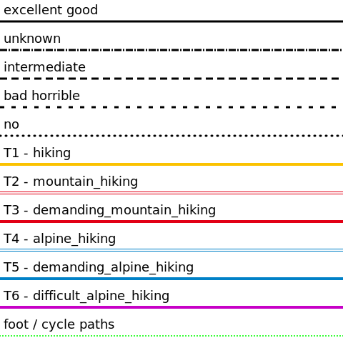
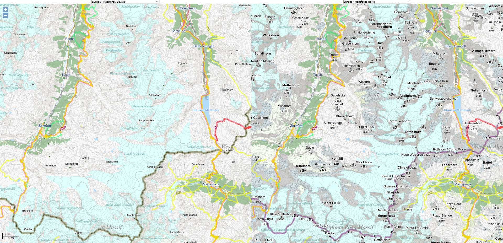
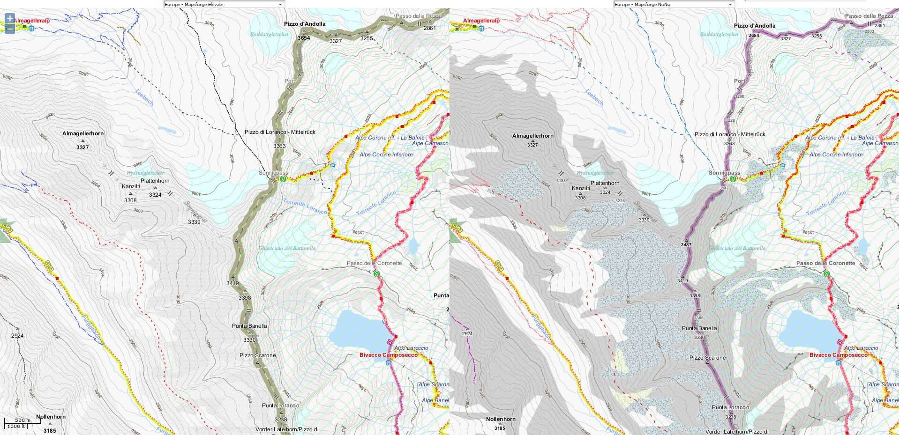
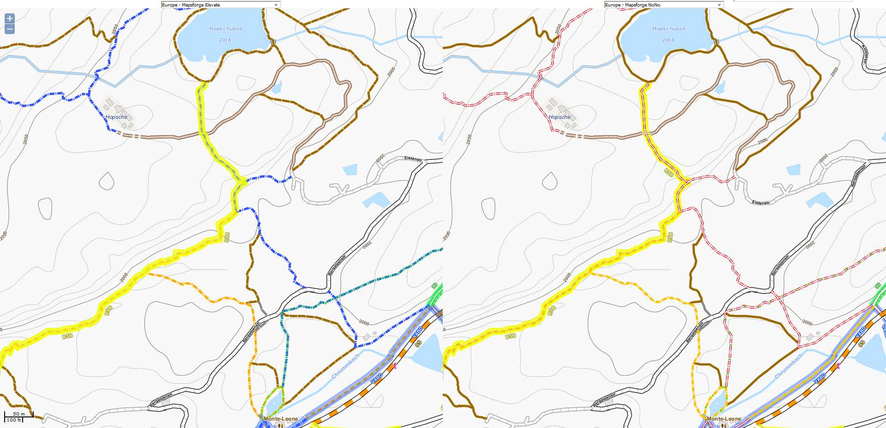

# RenderTheme for Mapsforge   
####  	*based on [Elevate](https://www.openandromaps.org/en/oam-forums/topic/elevate-updates-and-test-versions-news) & inspired by [Active_RT5](https://github.com/FrankSchoeneck/active_RT5)*  

### changes from [original Elevate](https://github.com/nono303/mapsforge-theme-elevate)  
- **improve saddle / pass visibility**   
  
  > - zoom-min: 14 > 12   
  > - ele: zoom-min=13   
  > - name: zoom-min=14   
  > - symbol-height=10: zoom=12-13  
- **improve terrain visibility / differentiation**  

  > - patterns & color: rock, scree, vineyard, orchard, quarry, fell, scrub, forest meadow   
  > - zoom-min: 13~14 > 12   
- **better & sooner displaying of peak & volcano**  
- **change color & reduce border#admin_level=2**  
- **improve cliff**  
- **change hillshading magnitude: 64 (default) > 128**  
- **refactoring hiking trails**  
  > - sac_scale differentiated by color only _(disabled dash for T4|T5|T6, dash modes only represent trail_visibility)_  
  >   related to:  
  >   - https://josm.openstreetmap.de/wiki/Styles/sac_scale  
  >       
  >   - https://www.okwirsindweg.ch/wanderskala-sac/  
  >       
  > - extract trail_visibility=no with a specific dash mode  
  > - lighten path overlay for foot & cycle shared  
  > - change overlay order (z-index) : hiking routes before hiking path  
  
### Example of changes 
> _without hillshading, click to enlarge_

